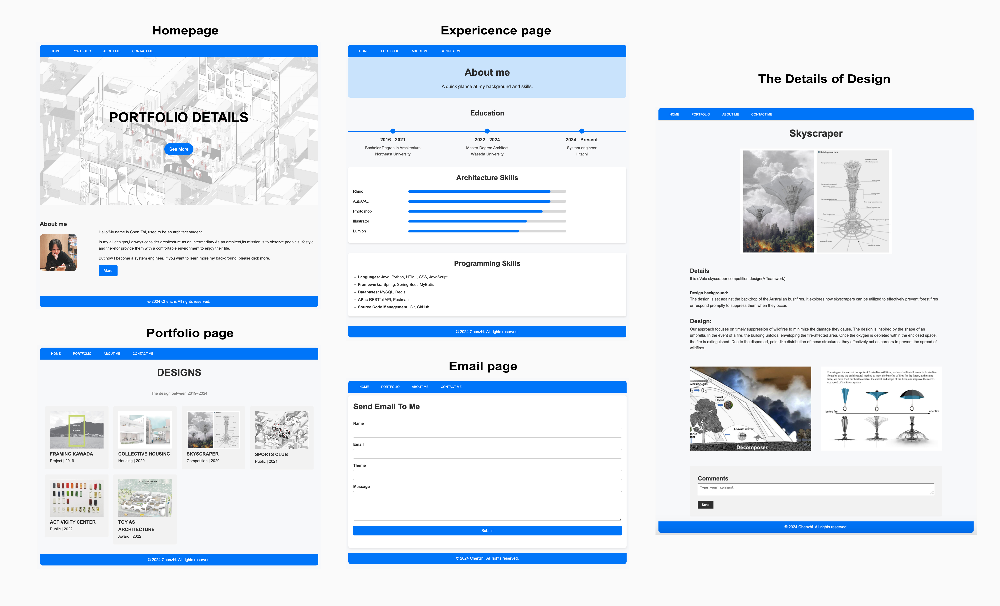
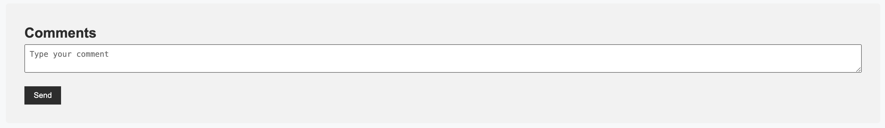
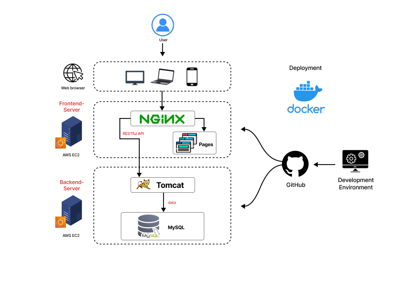
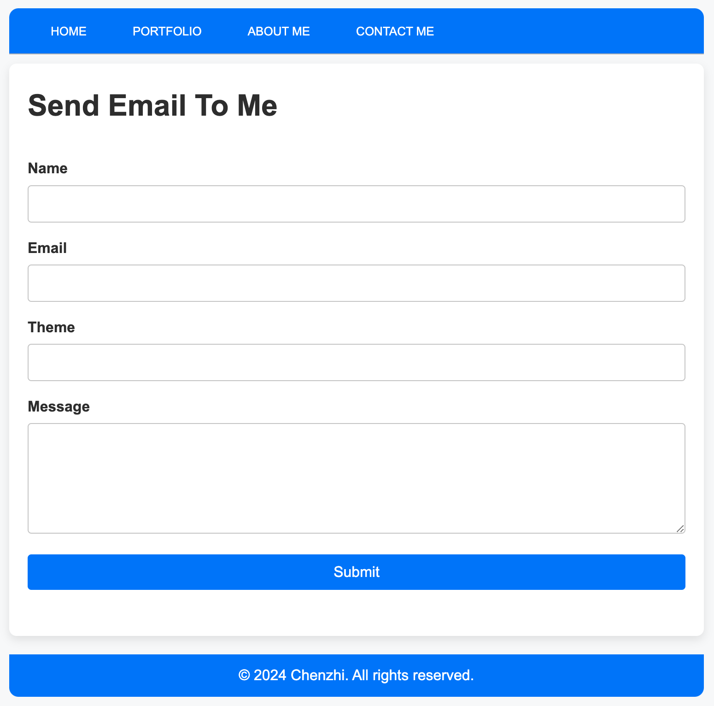

# URL
[MyWebSite](http://chenzhi.site/)
# 動機と概要
建築を学んでいた時代で、以下の課題を発見しました。
1.	建築学科の学生は多くの個人作品を持っており、それらをまとめてポートフォリオを作成するのが一般的です。従来のポートフォリオはPDF形式や冊子として印刷されることが多いですが、共有する際に不便さを感じることがあります。
2.	対面共有の場合を除いて、各作品に対して閲覧者から即時のフィードバックを得ることができません。
第三者プラットフォームに依存することのセキュリティ面を考慮し、自分の技術を活かして０→１ポートフォリオサイトを制作しようと考えています。  

# 画面表示
 

# 機能モジュール
- 表示モジュール
- インタラクションモジュール
  - commentモジュール
  - contact meモジュール
 
# Backend API
- comment API
訪問者のコメントをdbに書き込み、データを永続化する  

- Email API
GmailのSMTPのAPIが呼び出されて、自分宛にメールを送信する  

# 技術ステック
- フロントエンド: HTML,CSS,JavaScript（Reactで再構築中）
- バックエンド: Java,Spring,SpringBoot,Mybatis,MySQL
- 他の: docker, AWS EC2,AWS Linux,Nginx,Postman

# デプロイ
フロントエンドとバックエンドを別々のサーバーにデプロイする。フロントエンドはNginxのリバースプロキシを通じてバックエンドサーバーにアクセスし、バックエンドのアドレスを公開しないことでセキュリティを強化する。

# 🌏 Language Divider 🌏 

# Motivation and Overview
While studying architecture, I identified the following issues:
1.	Architecture students typically have many individual projects and compile them into a portfolio. Traditionally, portfolios are created in PDF format or printed as booklets, which is inconvenient for sharing.
2.	Except for in-person sharing, it is difficult to receive immediate feedback from viewers on each project.  
Considering the security concerns of relying on third-party platforms, I decided to utilize my technical skills to create a portfolio website from scratch (0→1).

# Pages
 

# Modules
- Display Module
- Interaction Module
  - Comment Module
  - ContactMe Module

# Backend API
- Comment API
Stores visitors’ comments in the database for data persistence.

- Email API
Calls Gmail’s SMTP API to send emails to myself.

# Tech Stack
-	Frontend: HTML, CSS, JavaScript (Rebuilding with React)
-	Backend: Java, Spring, Spring Boot, MyBatis, MySQL
- Other: Docker, AWS EC2, AWS Linux, Nginx, Postman

# Deployment Structure
The frontend and backend are deployed on separate servers. The frontend accesses the backend server through an Nginx reverse proxy, preventing the backend address from being exposed and enhancing security.

